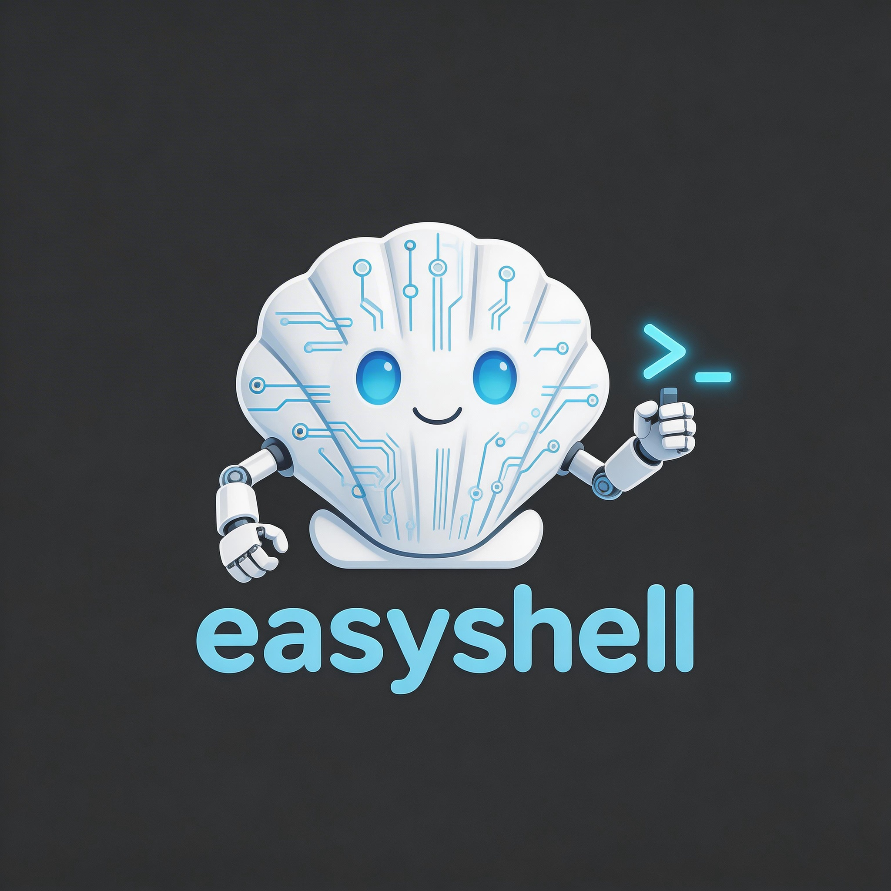

<p align="center">
  
</p>

# EasyShell

**Lightweight Server Management & Intelligent Operations Platform**

Server-Agent Architecture | Batch Script Execution | Real-time Logs | AI-Powered Ops | Bot Notifications

[](./LICENSE)
[](https://docs.easyshell.ai)
[](https://discord.gg/WqFD9VQe)

**Language**: English | [简体中文](./README.zh-CN.md) | [繁體中文](./README.zh-TW.md) | [한국어](./README.ko.md) | [Русский](./README.ru.md) | [日本語](./README.ja.md)

---

## Highlights: AI-Powered Scheduled Inspections

> **Cron → Script → AI Analysis → Bot Notification** — fully automated server inspection pipeline.

EasyShell can run **scheduled inspection tasks** on your servers via cron expressions, automatically collect script output (disk usage, service health, logs, etc.), send results to an **AI model for intelligent analysis**, and push the analysis report to your team through **bot channels** — all without human intervention.

**Supported Bot Channels** ([Configuration Guide](https://docs.easyshell.ai/configuration/bot-channels/)):

| Bot | Status |
|-----|--------|
| [Telegram](https://docs.easyshell.ai/configuration/bot-channels/) | ✅ Supported |
| [Discord](https://docs.easyshell.ai/configuration/bot-channels/) | ✅ Supported |
| [Slack](https://docs.easyshell.ai/configuration/bot-channels/) | ✅ Supported |
| [DingTalk (钉钉)](https://docs.easyshell.ai/configuration/bot-channels/) | ✅ Supported |
| [Feishu (飞书)](https://docs.easyshell.ai/configuration/bot-channels/) | ✅ Supported |
| [WeCom (企业微信)](https://docs.easyshell.ai/configuration/bot-channels/) | ✅ Supported |

**How it works:**
1. **Configure** a scheduled task with cron expression + shell script + AI prompt
2. **Execute** — EasyShell dispatches the script to target agents on schedule
3. **Analyze** — Script output is sent to your configured AI model (OpenAI / Gemini / GitHub Copilot / Custom)
4. **Notify** — AI analysis report is pushed to your bot channel (Telegram, Discord, Slack, etc.)

## Quick Start

```bash
git clone https://github.com/easyshell-ai/easyshell.git
cd easyshell
cp .env.example .env      # Edit .env if needed
docker compose up -d
```

No local build required — pre-built images are pulled automatically from [Docker Hub](https://hub.docker.com/u/laolupaojiao).

Open `http://localhost:18880` → login with `easyshell` / `easyshell@changeme`.

> **Want to use GHCR instead?** Set in `.env`:
> ```
> EASYSHELL_SERVER_IMAGE=ghcr.io/easyshell-ai/easyshell/easyshell-server:latest
> EASYSHELL_WEB_IMAGE=ghcr.io/easyshell-ai/easyshell/easyshell-web:latest
> ```

> **Developer? Build from source:**
> ```bash
> docker compose -f docker-compose.build.yml up -d
> ```

## Architecture

```
┌──────────────┐       HTTP/WS        ┌──────────────────┐
│  EasyShell   │◄─────────────────────►│   EasyShell      │
│    Agent     │  register / heartbeat │     Server       │
│  (Go 1.24)  │  script exec / logs   │ (Spring Boot 3.5)│
└──────────────┘                       └────────┬─────────┘
                                                │
                                       ┌────────┴─────────┐
                                       │   EasyShell Web   │
                                       │ (React + Ant Design)│
                                       └──────────────────┘
```

## Tech Stack

| Component | Technology |
|-----------|-----------|
| Server | Java 17, Spring Boot 3.5, Gradle, JPA/Hibernate, Spring AI, Spring Security |
| Agent | Go 1.24, single binary, zero runtime dependencies |
| Web | React 19, TypeScript, Vite 7, Ant Design 6 |
| Database | MySQL 8.0 |
| Cache | Redis 7 |

## Features

| Category | Features |
|----------|----------|
| **Infrastructure** | Host management, monitoring, cluster grouping |
| **Operations** | Script library, batch execution, real-time logs, web terminal |
| **AI Intelligence** | AI chat, **scheduled inspections with AI analysis & bot push**, inspection reports, operation approvals |
| **Administration** | User management, system config, AI model settings, risk control, agent orchestration |
| **Platform** | i18n (EN / ZH), dark/light theme, responsive design, audit logging |

## Screenshots

### Host Management


### Script Execution


### Real-time Logs


### Web Terminal


### AI Operations


### Security Controls


### Bot Integration

Supports [Telegram](https://docs.easyshell.ai/configuration/bot-channels/) · [Discord](https://docs.easyshell.ai/configuration/bot-channels/) · [Slack](https://docs.easyshell.ai/configuration/bot-channels/) · [DingTalk](https://docs.easyshell.ai/configuration/bot-channels/) · [Feishu](https://docs.easyshell.ai/configuration/bot-channels/) · [WeCom](https://docs.easyshell.ai/configuration/bot-channels/) — interactive chat & scheduled inspection notifications.


## Project Structure

```
easyshell/
├── easyshell-server/           # Central management server (Java / Spring Boot)
├── easyshell-agent/            # Agent client (Go, single binary)
├── easyshell-web/              # Web frontend (React + Ant Design)
├── docker-compose.yml          # Production deployment (pulls pre-built images)
├── docker-compose.build.yml    # Development (local build from source)
├── Dockerfile.server           # Server + Agent multi-stage build
├── Dockerfile.web              # Web frontend multi-stage build
├── .github/workflows/          # CI/CD: build & publish Docker images
└── .env.example                # Environment configuration template
```

## Documentation

Visit **[docs.easyshell.ai](https://docs.easyshell.ai)** for:

- Installation & deployment guide
- Getting started walkthrough
- Configuration reference
- Development guide

## Community

[](https://discord.gg/WqFD9VQe)

Join our Discord community for support, discussions, and updates:
**[https://discord.gg/WqFD9VQe](https://discord.gg/WqFD9VQe)**

## License

This project is licensed under the [MIT License](./LICENSE).
