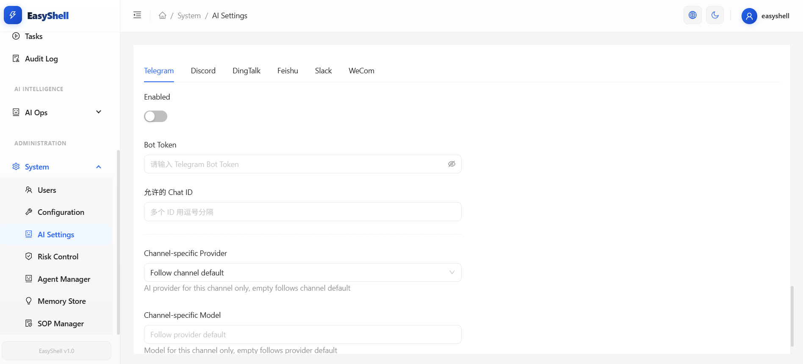

# EasyShell

**Легковесная платформа управления серверами и интеллектуальной эксплуатации**

Архитектура Server-Agent | Пакетное выполнение скриптов | Логи в реальном времени | AI-операции

[](./LICENSE)
[](https://docs.easyshell.ai)

**Язык**: [English](./README.md) | [简体中文](./README.zh-CN.md) | [繁體中文](./README.zh-TW.md) | [한국어](./README.ko.md) | Русский | [日本語](./README.ja.md)

---

## Быстрый старт

```bash
git clone https://github.com/easyshell-ai/easyshell.git
cd easyshell
cp .env.example .env      # Отредактируйте .env при необходимости
docker compose up -d
```

Локальная сборка не требуется — готовые образы автоматически загружаются из [Docker Hub](https://hub.docker.com/u/laolupaojiao).

Откройте `http://localhost:18880` → войдите с логином `easyshell` / `easyshell@changeme`.

> **Хотите использовать GHCR?** Укажите в `.env`:
> ```
> EASYSHELL_SERVER_IMAGE=ghcr.io/easyshell-ai/easyshell/easyshell-server:latest
> EASYSHELL_WEB_IMAGE=ghcr.io/easyshell-ai/easyshell/easyshell-web:latest
> ```

> **Разработчик? Сборка из исходного кода:**
> ```bash
> docker compose -f docker-compose.build.yml up -d
> ```

## Архитектура

```
┌──────────────┐       HTTP/WS        ┌──────────────────┐
│  EasyShell   │◄─────────────────────►│   EasyShell      │
│    Agent     │  register / heartbeat │     Server       │
│  (Go 1.24)  │  script exec / logs   │ (Spring Boot 3.5)│
└──────────────┘                       └────────┬─────────┘
                                                │
                                       ┌────────┴─────────┐
                                       │   EasyShell Web   │
                                       │ (React + Ant Design)│
                                       └──────────────────┘
```

## Технологический стек

| Компонент | Технология |
|-----------|-----------|
| Server | Java 17, Spring Boot 3.5, Gradle, JPA/Hibernate, Spring AI, Spring Security |
| Agent | Go 1.24, единый бинарник, без runtime-зависимостей |
| Web | React 19, TypeScript, Vite 7, Ant Design 6 |
| База данных | MySQL 8.0 |
| Кэш | Redis 7 |

## Возможности

| Категория | Функции |
|-----------|---------|
| **Инфраструктура** | Управление хостами, мониторинг, группировка кластеров |
| **Эксплуатация** | Библиотека скриптов, пакетное выполнение, логи в реальном времени, веб-терминал |
| **AI-интеллект** | AI-чат, плановые проверки, отчёты, утверждение операций |
| **Администрирование** | Управление пользователями, системные настройки, конфигурация AI-моделей, контроль рисков, оркестрация агентов |
| **Платформа** | Интернационализация (EN / ZH), тёмная/светлая тема, адаптивный дизайн, журнал аудита |

## Скриншоты

### Управление хостами


### Выполнение скриптов


### Логи в реальном времени


### Веб-терминал


### AI-операции


### Контроль безопасности


### Интеграция ботов (Telegram / Discord / DingTalk / Feishu / Slack / WeCom)


## Структура проекта

```
easyshell/
├── easyshell-server/           # Центральный сервер управления (Java / Spring Boot)
├── easyshell-agent/            # Клиент Agent (Go, единый бинарник)
├── easyshell-web/              # Веб-интерфейс (React + Ant Design)
├── docker-compose.yml          # Продакшен-развёртывание (готовые образы)
├── docker-compose.build.yml    # Разработка (локальная сборка из исходников)
├── Dockerfile.server           # Server + Agent многоэтапная сборка
├── Dockerfile.web              # Веб-интерфейс многоэтапная сборка
├── .github/workflows/          # CI/CD: сборка и публикация Docker-образов
└── .env.example                # Шаблон конфигурации окружения
```

## Документация

Посетите **[docs.easyshell.ai](https://docs.easyshell.ai)**:

- Руководство по установке и развёртыванию
- Начало работы
- Справочник по конфигурации
- Руководство для разработчиков

## Лицензия

Этот проект лицензирован по [лицензии MIT](./LICENSE).
